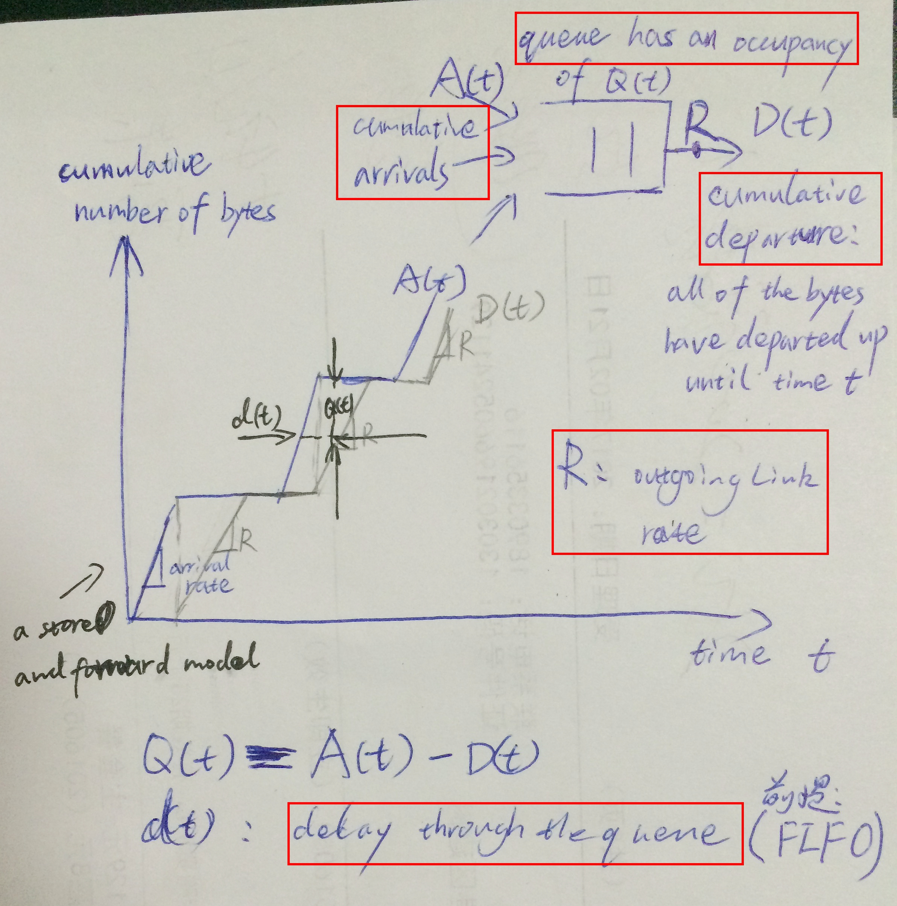
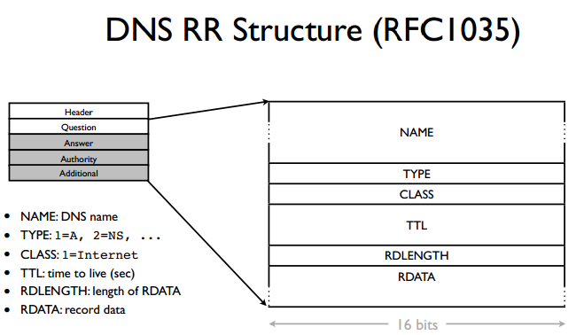

# Unit 1: The Internet and IP

## 1.1 A day in the life of an application  

Common communication model of networked applications: a bidirectional, reliable byte stream

- client-server model: World Wide Web，简称Web(using HTTP)
- peer-to-peer model: BitTorrent(tracker, swarm, torrent)
- skype: rendezvous or relay server

## 1.2 The 4 layer Internet model 

Link: packet is called **frame**

Network: packet is called **datagram**, 如果使用**Internet**，network层必须使用IP  

Transport: TCP packet is called **segment**, UDP packet is called datagram, ICMP packet is called message

Application: called **message** 

每一层只和对应的层交流，通过调用对下一层的API来利用下一层的服务，**socket**就是应用层对运输层的API

a **packet** has two types of fields: header fields and a payload field. The payload is typically a packet from the layer above.

a **hop** is a link between two routers

**理解protocol**：A **protocol **defines the format and the order of messages exchanged between two or more communicating entities, as well as the actions taken on the transmission and/or receipt of a message or other event.

## 1.3 The IP Service Model

### IP提供哪些服务？

基本服务：

- Datagram: 接受来自Transport层的segment作为datagram的data，将datagram作为Link层的data传给Link层
- Unreliable: 不保证按照顺序、一定到达、duplicate packet，而且发生这些错误也不会报告
- Best-effort
- Connectionless: 每个datagram之间是独立的，互相不知道的；IP service model doesn't contain a flow state that records the whole communication (it only cares about destination) in its network

更多服务：

- 防止loop，通过datagram header中的**time to  live(TTL)**阻止，router将TTL减1
- 如果Link层允许的packet大小小于datagram的，router可以**fragment** datagram
- 减小送错datagram的几率，通过datagram header中的**checksum**
- 允许新的IP版本：ipv4，ipv6
- 允许向datagram header中添加新的**field**从而添加新的feature

### 为什么如此设计IP？

- **end-to-end principle**：能在**end host**上加的feature，就不在network中加
- reliable和unreliable的服务都可以建在Network层上
- IP可以建在任何Link层上：IP makes very few assumptions about the link layer below
- 简单的IP快速、便宜，可以用dedicated hardware实现

## 1.4 A Day in the Life of a Packet

传输packet的过程：

Network layer is responsible for delivering packets to computers 

Transport layer is responsible for delivering packets to applications

- Tools

  - Wireshark

  - `traceroute -w 1 网址` 

    `-w 1`指明wait for reply的timeout为1s

    >**Traceroute** is a software program that displays the connection (path) through the Internet between this traceroute server and the location you enter above.  The Internet path between the two locations has many routers, computers and other devices along it which help move your information.  Each device along this path looks at your request and then sends it off to the next device until it reaches its destination. The Traceroute program shows the amount of time each device on the route takes to do three things: (1) receive the traceroute request (ICMP), (2) process that request and (3) send it back.  Traceroute performs this test three times on each device (each device is called a "hop").

  - windows中是`tracert` 

## 1-5: The Principle of Packet Switching

**Packet switching** is the idea that we break our data up into discrete, self-contained chunks of data. Each chunk, called a **packet**, carries sufficient information that a network can deliver the packet to its destination. 

### 设计理念

Packet switch(分组交换机): 不需要知道per-flow state，即packet属于哪个**flow**

而对应的在电话网络中应用的**circuit switching**，其switch是需要维护发送方-接收方connection state，并且为每个发送方-接收方维护一条连接链路

packet switching有两种方式：（1）**self routing**(不再使用)：packet的header中包含有它从source到destination的路线；（2）forwarding table: a switch can have a table of destination addresses and the next hop

**Flow**: A collection of datagrams belonging to the same end-to-end communication, e.g. a TCP connection.

### 好处

packet switch简单

多个flow可以充分利用link的能力(*Statistical Multiplexing*)

##  1-6: The Principle of Layering

layer只和上下层的layer交流，下层layer为上层提供了well-defined service，各layer可以随着时间改进而不影响其他层

举例：邮局系统；航空公司；编程

有时为了特殊目的，需要打破layering，比如在c语言中加入assembly code，使得上层和底层的processor不再相互独立。

## 1-7: The Principle of Encapsulation

Encapsulation allows you to layer recursively, 比如TCP segment可以在另一个TCP segment，应用VPN(virtual private network)

Encapsulation is how layering manifests in data representation

- Help separation of concerns

- Help enforce boundaries/layering

- Simplify layer implementations

##  1-8: Byte order and packet formats

**Internet**使用的协议都是**big endian**，即packet to be in a big endian format

network (byte) order is big endian，网络编程时需要将**network order**转为**host order**

文本数据在内存中的layout与字节顺序无关，在big endian和little endian的机器上显示结果相同

## 1-9: IPv4 addresses and CIDR

### IP address: 

- 32 bits, written as 4 octets, `a.b.c.d`
- IP address是与主机或路由器的**接口(Interface)**相关联的，主机和物理链路的边界叫做**接口(Interface)**，路由器有多个接口，继而多个IP address
- Internet中每台主机和路由器上的每个接口，必须有一个全球唯一的IP address(NAT例外)

### Netmask:

- A netmask tells the device which IP addresses are local -- on the same link/network(不需要经过router转发) -- and which require going through an IP router.

- 连续的1，从最高位开始
- `if IP address1 && netmask == IP address2 && netmask`, then they belong to the same subnet

### IP address如何分配的

- IP address: network+host

- 方法一(不再使用)：Class A, Class B, Class C: **prefix(or network prefix)**固定为8,16,24bits

- 方法二：**CIDR**：define **a block of** address

  address block/CIDR block：`a.b.c.d/x` describes 2^(32-x) addresses

  `x` is so called **CIDR address/prefix**, when we talk about a CIDR address, we refer to its netmask length

- 现实中的实现：

  IANA gives out /8s to **Regional Internet Registries (RIRs)**. 

  RIRs each have their own policy for how they break up the /8s into smaller blocks of addresses and assign them to parties who need them

  RISs再提供给**Internet Service Providers (ISPs)**

 ## 1-10: Longest prefix match (LPM) 

**Router**中有**forwarding table**，其包含CIDR entry(describing **a block of** address)和next hop

IP address与CIDR entry `a.b.c.d/x`匹配意味着，IP address的前`x`bits与`a.b.c.d`的前`x`bits相同

LPM意味着如果IP address和多个CIDR entry匹配，选prefix`x`大的

0.0.0.0/0匹配任意IP address

## 1-11: Address resolution protocol (ARP)

### IP address and link address

| IP address       | link address(such as Ethernet address)   |
| ---------------- | ---------------------------------------- |
| 32 bits          | 48 bits,  a colon delimited set of 6 octets written in hexidecimal |
| describes a host | describes a particular network interface card/network adaptor |

举例：（1）网关：the gateway or router has multiple interfaces, each with their own link layer address to identify the card, and also each with their own network layer address to identify the host within the network that card is part of.

（2）PC has Ethernet card and wireless card, each has their own IP address and link layer address

### ARP过程

ARP用于由IP address找到link layer address(MAC address, MAC地址是随网卡预置的)，仅为在同一子网中的主机和路由器

过程(*p310*)：

0. Every node keeps a cache of mappings from IP addresses on its network to link layer addresses. 

1. If a node needs to send a packet to an IP address it doesn’t have a mapping for, it sends a request. 以广播地址`ff:ff:ff:ff:ff:ff`作为帧的目的地址，将ARP packet封装到link层的frame中

   

2. Every node in the network receives it and refreshes its mapping between its link address，and its network address, or inserts a mapping if it doesn’t have one.

3. The node that has that network address responds, the replier whether send response to requester’s link layer address or broadcast it.

4. Nodes can also send what are called gratuitous ARP packets, requesting non-existent mappings, in order to advertise themselves on a network.

### 总结：发送IP datagram的过程（结合ARP）

# Unit 2: Transport

## 2-0: Transport

Network layer的服务是在主机间传输数据

Transport layer的基本服务是在进程间传输数据，包括**多路复用(multiplexing)**和**多路分解(demultiplexing)**

一个进程有一个或多个套接字(socket)，The job of delivering the data in a transport-layer segment to the correct socket is called **demultiplexing**. The job of gathering data chunks at the source host from different sockets, encapsulating each data chunk with header information (that will later be used in demultiplexing) to create segments, and passing the segments to the network
layer is called **multiplexing**. 

更通用的讲，whenever a single protocol at one layer (at the transport layer or elsewhere) is used by multiple protocols at the next higher layer，就会有multiplexing and demultiplexing 

## 2-1: TCP service model

TCP establish a two-way communication channel between the TCP peers at both ends. We call the two way communication a **connection**. At both ends of the connection, TCP keeps a **state machine** to keep track of how the connection is doing. 

### TCP提供哪些服务

### TCP过程

### TCP segment构成

TCP将应用要传输的数据看成byte stream，sequence number和acknowledgment sequence number就是指在应用数据byte stream中的位置，而不是在TCP segments中的位置。

TCP’s use of sequence numbers reflects this view in that sequence numbers are over **the stream of transmitted bytes** and not over the series of transmitted segments.

The Sequence number indicates **the position in the byte stream** of the **first byte in the TCP Data field**

ACK表明该值之前的bytes都收到了，下次从该值处的byte开始接收

**port field**: 16bits

## 2-2: UDP service model

UDP(User Datagram Protocol/User Demultiplexing Protocol)

### UDP服务

### UDP datagram构成

the UDP checksum calculation also includes a portion of the IPv4 header as well, including the IP source and destination addresses and the protocol ID which has the value of 17 and tells us that the IP datagram carries UDP data. It allows the UDP layer to detect datagrams that were delivered to the wrong destination.

### 使用UDP的application

一类应用仅仅是request-response，request都在一个UDP datagram中，If the request is unsuccessful, it simply times out and is resent. 

- DNS(domain name system): turn a hostname into an IP address, the request is fully contained in one UDP datagram
- DHCP(Dynamic Host Configuration Protocol): DHCP helps a new host find out its IP address when it joins a network. 

另一类应用是自己实现retransmission

- A few real-time streaming audio and video services
- Early versions of NFS(the network file system)

## 2-3: ICMP service model

ICMP(Internet Control Message Protocol)是Transport Layer的protocol，但描述的是Network Layer的信息, 为Network Layer服务

### ICMP message构成

### 使用ICMP的application

- ping

  source host sends a Echo Request type ICMP message to destination host

  destination host sends a  Echo Response type ICMP message back

- traceroute：得到source host到达每个router和destination host的round trip delay

  1. source host发送UDP segment，其port number故意设置为不可用，IP datagram中的TTL field由1开始增加；
  2. 当TTL减为0时，router会发送给source host一个TTL Expired ICMP message；
  3. 当destination host最终收到UDP segment，找不到port，会发送给source host一个port un-reachable ICMP message；
  4. source host收到后停止发送UDP segment

## 2-4: End-to-end principle

### end-to-end principle

要想正确实现endpoint需要的功能，需要endpoint的相关信息，因此network不可能实现；

不过，出于提高performance的目的，network可以实现部分功能；

但是，最终保证endpoint功能正确性的责任，还是落在endpoint上

举例

- file transfer

  虽然link layer有error detection，不过这仅保证传输过程没有错误，不保证在endpoint上的储存没有错误。因此，保证文件正确到达的唯一方法只有end-to-end check

- TCP reliable delivery

  wireless link layers improve their reliability by retransmitting at the link layer. TCP will work correctly -- it will reliably transfer data -- **without this link layer help**. But the link layer help greatly improves TCP’s performance.

### strong end-to-end principle

功能不能在network中实现（一点儿也不行），只能在fringes处实现

因为如果出于某些performance的考虑，在network实现了endpoint部分功能，那么这些功能是基于endpoint的某些假设实现的，那么今后其他的endpoint都要受限于network这些假设。

即虽然network获得短期的性能提升，不过导致network未来难以改变。

## 2-5: Error detection

### 各种error detection算法能够检测出那些错误

|            | Checksum           | CRC(Cyclic Redundancy Check)             | MAC(Message Authentication Code) |
| ---------- | ------------------ | ---------------------------------------- | -------------------------------- |
| 100%检测出的错误 | a single bit error | a single burst of errors ≤ c bits long; an odd number of bit errors;  2 bits in error | None                             |
| 很大可能检测出的   | None               | `1 - 1 / 2^c`                            | `1 - 1 / 2^c`                    |
| 采用该算法的协议   | IP TCP             | Ethernet                                 | TLS                              |

### 各种算法如何实现(简要)

[burst error](https://en.wikipedia.org/wiki/Burst_error#cite_note-1) 

个人理解：

- a burst error of n bits error：连续n bits的错误
- burst error length：首个错误bit和最后一个错误bit之间的距离

## Finite State Machines(FSM)

state 

event：event that can cause a state transition

action：the action the **protocol** takes on making that state transition

## Reliable Communications

### 实现可靠连接需要解决以下问题：

- 如何发现丢包，如何保证包的顺序
- 发现丢包后如何重传
- 实现可靠连接可以不在双方维持状态，不过，Reliable communication typically benefits from have some state on each，由此产生的问题是：
  - 如何设置这些状态
  - 如何清除这次状态

### Flow control

解决的问题：Don’t send more packets than receiver can process

方法：

#### 1. stop and wait protocol

- At most one packet in flight at any time
- at most one packet的理解：被发送的、未被确认的packet数目为1

#### 2. sliding windows protocol

- At most N packets in flight at any time:Allow a “window” of unacknowledged packets in flight

- retransmission的表现：

  - RWS=1，protocol表现为GBN
  - SWS=RWS=N>=1，protocol表现为SR

- 根据RWS(receive window size)、SWS(send window size)确定sequence number:

  Supposed packets not delayed multiple timeouts, at least need RWS+SWS sequence numbers，

  关键需要足够的sequence number解决flow control中的duplicates问题，即how to detect duplicates, 如何检测新的packet，还是超时重传的以前已经接受到的packet

  原因：

  假如SWS=3，RWS=2，sequence number为3，即packet编号为0,1,2,0,1,2...(至少如此才能保证一个send window中的packet编号不同)，主机A为发送方，B为接收方。

  当B接收到第一、二、三的包(0,1,2)，交付给上层应用，发送三个ACK，接下需要第四、五个包(0,1)；

  三个ACK全部lost，则超时后，A会重传第一、二、三的包(0,1,2)，此时接收方B无法分辨出0,1是新的包(第四、五个包)，还是重传的已经接收的包；

  当sequence number为5，即packet编号为0,1,2,3,4；依然是上面的情况，B接下需要编号为3,4的包；此时新的包(3,4)与重复的包(0,1)就区分开了。而且，当B再次需要新的编号为0的包的时候，即B已接收并交付3,4，主机A处旧的编号为0的包一定已经ACK(否则B不能接收到3,4，因为SWS=3)，因此A发送过来的编号为0的包一定为新的包，不会有歧义，如图

  

### Retransmission strategies(*Top-down* P147-154)

#### 回退N步GBN(Go-Back-N): RWS=1

发送方使用一个retransmit timer，收到一个ACK，timer被重启

某个packet超时，则认为该packet丢失，重传整个send window，即重传所有已发送带还未确认过的packet

采用**cumulative ACK**，表明ACK number n以前及n在内的packets被正确接收

接收方不缓存乱序的packet，直接丢弃

#### 选择重传SR(Selective Repeat)

为每个packet维持一个timer

只有每个packet的timer超时，才认为该（一个）packet丢失，只重传该packet

采用selective ACK，ACK number为刚刚正确收到packet的sequence number

接收方缓存乱序的packet，If this packet has a sequence number equal to the base of the receive window, then this packet, and any previously buffered and consecutively numbered  packets are delivered to the upper layer

#### GBN和SR的优劣：

if there are bursts of losses, GBN is faster

假设一组连续的包丢失，SR需要等待其中的每一个packet的timer超时，才会重传该packet，由此计入了每个packet的timer和round trip time

而GBN则只需要等待一次timer超时，就会重传所有的包，timer和round trip time只计一次

### TCP实现可靠传输(P163-P169)

TCP的ACK、timer部分像GBN

TCP的重传、乱序的处理像SR

- timer：推荐使用一个retransmit timer

- TCP的ACK：基于byte，而非packet；cumulative ACK, 而且ACK number是指接下来要接收byte的sequence number

- TCP对乱序packet的处理：没有明确规定，可以丢弃，可以缓存(实际中采用)

- TCP的重传：for N packets, *n*th packet lost, but the remaining N – 1 acknowledgments arrive at the sender before their respective timeouts. In this example, GBN would retransmit not only packet n, but also all of the subsequent packets n + 1, n + 2, . . . , *N*. TCP, on the other hand, would retransmit at most one segment, namely, segment *n*. Moreover, TCP would not even retransmit segment n if the acknowledgment for segment n + 1 arrived before the timeout for segment *n*.

- TCP中的flow control：采用sliding window

  The TCP packet header includes a window size field for each side to communicate how large its receive window is.

  - receiver在TCP header中的window field设置RWS：

    `RWS = RcvBuffer – [LastByteRcvd - LastByteRead]` 

    其中LastByteRead: the number of the last byte in the data stream read from the buffer by the application process

    LastByteRcvd: the number of the last byte in the data stream that has arrived from the network and has been placed in the receive buffer

    

  - sender需要保证：`LastByteSent - LastByteAcked <= RWS` 

  - 当`RWS == 0`时，sender时不时发送仅含一个byte的“窗口探测”segment，以获取新的窗口大小的信息

### TCP Connection setup and teardown

#### setup

3-way handshake

simultaneous open

#### teardown

a SYN or FIN in a TCP segment consume a sequence number, it's so that the SYN and FIN themselves can be acknowledged (and therefore re-sent if they're lost).

- simultaneous close

- TIME_WAIT状态的作用

  -  to make sure that the final ACK is not lost

  - to avoid data corruption in the case that ports are immediately reused and there is a sequence number overlap

    https://vincent.bernat.im/en/blog/2014-tcp-time-wait-state-linux

- active close side如何确认它回复的ACK被passive close side成功接收了？

  [Why does a SYN or FIN bit in a TCP segment consume a byte in the sequence number space?](https://stackoverflow.com/questions/2352524/why-does-a-syn-or-fin-bit-in-a-tcp-segment-consume-a-byte-in-the-sequence-number)

  如果passive close side没有收到ACK，会继续发FIN，只要active close side在2MSL(Maximum Segment Lifetime)中没有再收到FIN，则说明passive close side成功收到ACK。

  The final ACK is resent not because the TCP retransmits ACKs, but because the other side will retransmit its FIN. Indeed, TCP will always retransmit FINs until it receives a final ACK

## 网络工具使用

wireshark

nslookup: domain name to IP address

telnet: 

1. `telnet IP address port`
2. `ctrl + ]`
3. 进入telent后，回车进入编辑界面，编写要发送的HTTP message

ping

tracert

视频：

​	CSAPP 21-netprog1

​	CSAPP 22-netprog2

​	[1-4: A day in the life of a packet](https://lagunita.stanford.edu/courses/Engineering/Networking-SP/SelfPaced/courseware/ac9d1eef5aaa4bb5bcfe4d42f51f0f5b/d38948f20a2249508e3fc8c675b2738c/)

​	[2-11: Reliable Communications - Connection setup and teardown](https://lagunita.stanford.edu/courses/Engineering/Networking-SP/SelfPaced/courseware/c43cc41ee5764363b36ddd99c8b32f26/939e91b43c124bbb913616f6cc6f9c5b/)

​	[Wireshark Tutorial for Beginners](https://www.youtube.com/watch?v=TkCSr30UojM&t=319s)

# Unit 3: Packet Switching

## 本单元回答以下问题

1. understand the three main components of packet delay: the packetization delay, the propagation delay, and the queuing delay; and that you understand the physical processes that cause them
2. understand why routers have buffers, and how queuing delay leads to uncertainty about when packets will arrive. how playback buffers are designed for real time streaming applications
3. how packet switches work in practice “How does an Internet router actually work?”, and “How is it different from an Ethernet switch?”. “How does a router arrange its lookup tables?”

## Packet Switch

### Internet使用packet switching的原因

- Efficient use of expensive links
- Resilience to failure of links & routers

**packets share the same link**：当多个packets同时出现且想去同一个link时，由于packet switch send packet-by-packet, 所以某些packet需要在switch queue中等待。

### 组成

- buffer

  two packets showed up at the same time wanting to travel across the same link, then some of the packets have to wait in the router’s queue, or packet buffer

- forwarding table 

  | address | next-hop |
  | ------- | -------- |
  |         |          |

### 过程

lookup address --> may update header --> queue packet

#### Lookup address

- 硬件层实现

#### Switch packets to egress port

- **output queue**

  An output-queued switch is perfect in the sense that you can't achieve a higher throughput, or you can't achieve a lower average delay. 

  **work conserving**: an output line is never idle when there is a packet in the system waiting to go to it

  

- **input queue**

  

- **virtual output queue**: no packet can be held up by a packet ahead of it going to a different output

  

- input queue比output queue的好处:

  Only require memory bandwidth of 2 * R instead of (N+1) * R for an output queued switch.

- virtual output queue比input queue的好处：消除了**head of line blocking**

### 分类

| Router                                   | Ethernet switch                          |
| ---------------------------------------- | ---------------------------------------- |
| 属于link layer和internet layer              | 属于link layer                             |
| 基于网络层字段中的值做转发决定                          | 基于链路层字段中的值做转发决定                          |
| 具有IP address和link layer address          | 不具有与其接口相关联的链路层地址，即主机或路由器无需明确将帧寻址到其间的交换机(*p307*) |
| 需要ARP                                    | 不需要ARP                                   |
| receives routing protocol messages来设置forwarding table | 自学习来设置                                   |

#### **Router**

- 详细过程
  1. Ethernet DA是否属于router，否则丢弃，不向上层传递
  2. 减少TTL，update IP header checksum
  3. lookup IP DA in forwarding table
  4. find Ethernet DA for next hop router using **ARP**
  5. create a new Ethernet frame and send it

- lookup address: 
  - Longest prefix match
    - Binary tries
    - Ternary Content Addressable Memory (TCAM): binary value + mask

#### **Ethernet switch**

- 详细过程
  1. 检查到达frame的header
  2. 如果Ethernet destination address在forwarding table中，转发至正确port；不在，广播该frame
  3. forwarding table是通过Ethernet switch自学习建立的，将到达frame的Ethernet SA加入到表中
- lookup address: 
  - hash table
  - exact match

switching的方式有两种：

- store and forward: wait until the whole packet arrives until they look up the address and decided where to send it next, 比如Internet router

- cut through: start forwarding the packet after they’ve seen the header and not wait for the whole packet to arrive

## End-to-end delay

- propagation delay

- packetization delay

  data rate/the number of bits per second that we can put onto the link

- queuing delay

congestion: lots of packets queued waiting to travel along the link

## Playback Buffer

## Simple Deterministic Queue Model

### Simple deterministic queue model

### Small packets reduce end to end delay

### Statistical multiplexing

Multiplexing == sharing. Statistical multiplexing == sharing using the statistics of demand.

**statistical multiplexing**：由于多条输入链路data rate的峰值是错开的，使得平均data rate平稳，则对输出链路的data rate的要求小于多条输入链路的峰值之和

**Statistical multiplexing gain**

- 考虑buffer
- 不考虑buffer

## Queuing Model Properties

- Little's Result: `L=λ*d`

  L: a average occupancy of a queue

  d: average delay

  λ: average arrival rate

  

## Rate guarantee

how to serve every queue in a router at a minimum rate?

If all packets were the same length, this would be trivial. But different packets have different lengths, so we need to take into consideration how long each packet is. This is where **Weighted Fair Queuing** comes in. It tells us the correct order to serve packets in the router queues, so as to take into consideration the length of individual packets.

- delay through the queue <= B/R

  size of the queue: B

  the rate at which it's being served: R

- **FIFO queues** are a free for all: 

  No priorities and no guaranteed rates

- Strict priorities queue

  根据IP header中的type of service field

- **Weighted Fair Queuing(WFQ)**

  lets us give each flow a guaranteed service rate, by scheduling them in order of their **bit-by-bit finishing times**

  

  

  证明WFQ可以保证rate？

  - 证明过程
    1. 证明：采用bit-by-bit可以实现rate guarantee
    2. 证明：packet-by-packet的finish time比bit-by-bit的finish time晚一些
    3. 证明：调度器按照bit-by-bit的finish time调度，实际的finish time是按照packet-by-packet；不过时间足够长时，实际depart的bits数量和bit-by-bit下depart的bits数量相同，即和bit-by-bit下rate的公式相同，实现了rate guarantee
  - 引入magic queue

## Delay guarantee 

- delay <= B/R

  - 可以通过WFQ控制R
  - 可以设置B

- 如何做到不丢包?

  - 采用*(sigma, rho) regulation*

    - serve rate >= rho
    - B >= sigma

    

- 如何实现(sigma, rho) regulation

  - 在source端通过leaky bucket实现

- 如何设置在path上的sigma, rho, serve rate和B

  **Resource Reservation Protocol(RSVP)**

- 整体过程

  If flows are leaky-bucket constrained, and routers use WFQ, then end-to-end delay guarantees are possible.

   

- 3-10 00:20:46 example

# Unit 5: Applications and NATs

## 本单元需要掌握

- Application层
  1. DNS using UDP, client-server model
  2. HTTP or World Wide Web using TCP, client-server model
  3. BitTorrent, using TCP, peer-to-peer model
  4. DHCP
- NATs
  - multiple endpoints/a network hide behind a single IP address
  - translating addresses primarily in the direction that goes from the edge towards the core, makes it hard for application that wants to initiate communication with an edge device

## NAT(network address translator)

when packet **traverses** the NAT, the NAT translate the network address, rewrites source address and source port.

mapping (internal IP, port) pair to (external IP, port) pair

local private IP address in 10. range or 192.168. range

硬件：NAT通常运行在路由器中

### 好处

- share public IP address
- security

### 类型(What packets does a NAT allow to traverse mappings? )

1. full cone NAT
2. restricted cone NAT
3. port restricted NAT
4. symmetric NAT: port restricted

1,2,3是只要internal IP address和port相同，就是同一个mapping

4即使internal IP address和port相同，但destination address不同，也是不同的mapping，即external port不同

- symmetric NAT带来的问题？

  [Symmetric NAT and It’s Problems](https://www.think-like-a-computer.com/2011/09/19/symmetric-nat/)

- What happens when you have a node that's behind your NAT. And it sends a packet to one of the external interface port pairs that the NAT has?

  **Hairpinning**

  

### NAT的影响

- 对application的影响

  NAT allow connections out, but don't allow connections in.

  因为从NAT的external到internal需要mapping，而mapping只能在packet从internal到external时建立， server/client behind NAT don't issue connection requests out

- application的应对方法

  - connection reversal: use rendezvous server

  - relays

  - NAT hole-punching:

    1. A, B are both behind NATs
    2. 通过external server得知external IP address and port
    3. A, B同时向对方send traffic, 得以在mapping添加对方IP address, 使得到达的对方的packet可以traverse the NAT

    full cone NAT, restricted cone NAT, port restricted NAT均支持这种方法

    symmetric NAT不支持

- 对Transport Layer的影响

  No new transport protocol

  因为NAT需要知道采用的transport protocol

- 对Internet的影响

  narrow waist IP --> the new hourglass

  

### Behavior

- **static mapping**

  A static mapping is configured so that traffic is always mapped a specific way. You could map all traffic to and from a specific private network location to a specific Internet location. For instance, to set up a Web server on a computer on your private network, you create a static mapping that maps [Public IP Address, TCP Port 80] to [Private IP Address, TCP Port 80].

  [Static and Dynamic Address Mapping](https://technet.microsoft.com/en-us/library/cc957905.aspx?f=255&MSPPError=-2147217396)

- **port triggering**

  *Port triggering* opens an incoming port when the user's computer is using a specified *outgoing port* for specific traffic.

  [Port Triggering](http://kmlstudy.blogspot.com/2008/06/router-port-triggering.html)

- **How would the NAT respond if you tried to open a connection to it?**

  the NAT behaves like a normal IP device or an IP router with the exception of, when packets come to the external interface that have a mapping or when packets traverse from the internal interface and generate a mapping. NAT can respond to connections.

- **When does a NAT set up mapping and when to tear down them?**

  - set up

    when a packet comes from the internal interface going to external. The NAT sets up a mapping, mapping that IP address, port to an external IP address, port.

  - tear down

    - UDP time out
    - TCP see FIN/ACK 

- **RFC behavioral recommendations for NAT**

  - UDP

    1. NAT不能是symmetric NAT
    2. 如果NAT有多个external address, UDP packets coming from the same internal IP address, should appear to have the same external IP address. 
    3. if the internal port is between zero and 1023, then the external port should be between zero and 1023. If it's in 1024 to 65535, then the external should be between 65535
    4. ...

  - TCP

    1. NAT不能是symmetric NAT

    2. NAT需要支持TCP simultaneous open, 更general的说法, NAT需要支持任何一种TCP state diagram中open a connection的方法

       

    3. NAT是full cone NAT

    4. a NAT must not respond to an unsolicited inbound SYN for at least six seconds

       因为如果过早的send ICMP error, 会过早的tear down mapping state

       

    5. ...

    ​

## HTTP

- HyperText: 

  - ASCII text

    The bits of the image aren’t stored in this hypertext document. That wouldn’t be human readable ASCII text. Instead, there’s a way to, in a hypertext document, say “load this other document and put it here.” 

- **HTTP message(HTTP报文): ASCII text**

  URL: ASCII

- 掌握通过画图分析HTTP request/response的时间
  - 全双工(full duplex)意味着: a node can simultaneously receive and transmit on the same link. This means the packetization delay of a request does not affect the packetization delay of a response.

- HTTP/1.0

  1. open connection
  2. Issue GET
  3. Server closes connection after response

- HTTP/1.1

  **server可以在response后自行选择是否关闭connection**

  - Added Connection header for requests

    **不过connection header just gives server a hint, server can do what it wants**

    - keep-alive: tells the server “please keep this connection open, I’ll request more”
    - close: tells the server to close the connection
    - Server can always ignore

  - Added Connection header for responses

    - keep-alive: tells the client it’ll keep the connection open
    - close: tells the client it’s closing the connection

  - Added Keep-Alive header for responses

    - Tells client how long the connection may be kept open

- SPDY

  - One issue HTTP sometimes runs into is that the order in which a client requests resources is the same that the server responds. 

    If the client requested the slow page first, it won’t receive any of the images until after it receives the page. It would be nice if the server could respond in a different order, and say start sending the images while the page is being generated

## BitTorrent

两个关键问题:

1. 先请求哪些pieces？

  **rarest first**
  - the rarest chunks get more quickly redistributed, aiming to (roughly) equalize the numbers of copies of each chunk in the torrent.
  - This ensures that the most commonly available pieces are left till the end to download.

2. 向哪些peer发送数据？

  peer可以建立很多TCP connection, 面对向它发送请求的peer，它要想哪些发送数据

  **tit-for-tat**, to discover potentially good new peers, the client also randomly unchokes a peer periodically

## DNS(Domain Name System)

domain name: `bit.edu.cn`

hostname: `www.bit.edu.cn`

### DNS Name Architecture

root: empty name/dot

top-level domain(TLD)

domain 

subdomain

### DNS servers

root DNS server: 13 root server，highly replicated, 利用**anycast**每个server有多个具有相同IP address的主机

TLD server

authoritative DNS server

local DNS server(/default name server/resolver)

### DNS message

#### 分为两类

DNS query message和DNS response message

DNS query的Question数目通常为1，其余为0；

DNS response有Question，Answer数目至少为1

#### 格式

#### Resource Records

All DNS information represented in Resource Records 

Resource Records分类

- DNS A Record

- DNS AAAA Record

- DNS NS Record

- CNAME Record

  `alias-name [TTL][class] CNAME canonical-name`

  if you there's a CNAME record for a name, there can't be any other records for the name

- MX Records

- PTR: map address to name

#### Name compression

当长度的byte最高两位为1时，name is compressed，剩余位和随后字节中的组成形成一个14位的offset，距离DNS segment开始处的offset

具有相同的suffix才可以压缩表示，因为name从后往前才是DNS name从高到低

DNS A Record Answer name may be compressed

DNS NS Record Answer name is compressed

#### Glue record

DNS use UDP/TCP

when DNS use TCP: Prefix messages with 16-bit length field

原因：DNS的query和response的长度是变化的，封装DNS的包需要指明长度；

UDP segment中具有length field(header plus data), 而TCP segment中只有header length field, requires message boundaries.

> UDP is by definition a packetized transport, where packet boundaries are kept.
> TCP is stream oriented: no boundaries are guaranteed to go through. For this reason, all TCP variants of packetized transports (SIP, RTP, etc) include an extra prefix giving the length of the data unit.
>

## Dynamic Host Configuration Protocol (DHCP)

子网中需要有DHCP server，或者使用路由器作为relays to forward across links；通常说DHCP server运行在路由器中

UDP ports 67(server) and 68(client)

### Communicating with IP需要

- 必需**IP address, subnet mask, gateway/router**
- 非必需DNS server IP address(直接使用IP地址时则不需要)

### DHCP message分类

Discover, offer, request, ack, release

discover的DA使用Broadcast IP address: 255.255.255.255

request的DA使用Broadcast IP address: 255.255.255.255，The packet is sent as a broadcast so that other DHCP servers see that their offer was not chosen and can be withdrawn

offer, ack的DA是否使用广播地址取决于broadcast bit

> "DHCPOFFER" message from DHCP to DHCP Client is unicast or broadcast?
>
> In the DHCP discover there is a flag called the broadcast bit that the client uses to tell the server how he would like the offer to be: broadcast if it is on or unicast if it is off but the server  makes the final decision based on its capability.

## 路由器相关

**LAN**(local area network)局域网

Although there are many types of LAN technologies, Ethernet is by far the most prevalent access technology in corporate, university, and home networks. 

硬件上采用**交换机(switch)**或**集线器(hub)和网桥(bridge)**构成LAN

Hub：不加分辨地将从一个端口上收到的每个位复制到其他所有的端口上

**WAN**(wide area network)广域网：多个不兼容的局域网可以通过路由器连接起来

*CSAPP*第11章

## 浏览器中输入baidu.com后发生什么

*计算机网络-自顶向下方法* P329

ICMP 运输层协议

DHCP DNS 应用层协议，封装到UDP中

ARP 网络层协议，封装到链路层帧中，ARP packet包含了SA DA SMAC DMAC， ARP table缓存于主机和路由中，

Wireshark PDU

It means that Wireshark thinks the packet in question contains part of a packet (**PDU-Protocol Data Unit**) for a protocol that runs on top of TCP，即数据超出了TCP的最大MSS

If the reassembly is successful, the TCP segment containing the last part of the packet will show the packet.

MSS: maximum segment size 最大报文长度， TCP中的概念

## Unit 4: Congestion Control

### Congestion Control的要求

1. high throughput: maximize link utilization
2. fair share
3. avoid congestion collapse, 即保持link full的数据是useful的，而非很多retransmission数据，避免full utilization of link, while simultaneously **no application level throughput**

目标

1. High	throughput: Keep links busy and flows fast
2. Max-min fairness
3. Respond quickly to change network conditions
4. Distributed control

使用fair queuing可以实现Max-min fairness, decompose the output buffer into **per-flow** queues, 不过FQ不responsive

### Congestion Control的实现

- 在network中实现

  ECN(explicit congestion notification), routers indicate congestion

- 在end host实现

  不需要network的support, end-host observe the network behavior(time out and duplicate ACK), TCP Congestion Control，那么如何设置CWND？

  **Optimal congestion window size** is the bandwidth-delay product

### AIMD

**outstanding packet**: unacknowledged packets(have sent, but not yet received an acknowledgement)

~~AIMD controls the rate at which packets are sent~~, it is not strictly true. All AIMD does is control the number of outstanding packets in the network.

#### Single flow

The **sending rate**(R = W / RTT) is constant if we have sufficient buffers (RTT x C)

- 为什么buffer size at least RTT*C？

希望bottleneck link utilization一直为100%

详细解释：

CWND减半后，sender会先暂时停止send，等待buffer排空。因为sliding window限制了outstanding packet的数量为RTT\*C，而此时buffer中就有RTT\*C个packet。

#### Multiple flow

- RTT为常数

  这里的“RTT为常数”是指**每条flow各自**的RTT为常数，

  原因：因为with many flows, each flow follows its own AIMD rule;

  if the bottleneck contains packets belonging to many different flows,then the buffer is going to remain highly occupied all the time. This means the RTT is constant.

- sending rate/throughput = 两次丢包之间send packet数量A /  两次丢包之间时间

  两次丢包之间时间 = RTT \* (Wmax / 2)

  两次丢包之间send packet数量A = sum(Wmax / 2, ..., Wmax)

  packet drop probability p: 每发送A个packet，drop one packet `p = 1/A`

#### 为什么AIMD可以满足Congestion Control的要求？

*Chiu Jain Plot*

无论起点在哪里，最终沿Fair line在desired point(绿点)附近振荡。

### TCP Congestion Control

Three questions that a transport protocol needs to answer, if it is going to provide reliable transport.[理解protocol](#1.2 The 4 layer Internet model)

问题1：收到ACK是send new data, self-clocking

问题2：time out, or fast retransmission

问题3：receive new packet

#### Pre-Tahoe

- send **flow control** window size packets
- start a retransmit timer for each packet
- no congestion control

#### Tahoe

- Congestion window

  - Exploits TCP’s sliding window used for flow control

    

  - Tries to figure out how many packets it can safely have outstanding in the network at a time.

- Timeout estimation

  - Pre-Tahoe

    根据RRT的估计值和实测值计算Exponentially weighted moving average(EWMA)，来设置timeout

    缺点：无法应对RTT distribution是变化的

  - Tahoe

    计算RTT的EWMA

    计算variance(实测值与估计值的偏差)的EWMA

    二者结合设置timeout

- Self-clocking

  - TCP only puts a new packet into the network when it receives an acknowledgment or when there‘s a timeout. It means TCP only puts packets into the network when packets have left the network.

  - 使网络上的包数量守恒

    ​

#### Reno

- fast recovery
- fast retransmit

#### New Reno

- fast recovery

- fast retransmit

- congestion window inflation: start sending out new packets while fast retransmit is in flight, We don't have to wait for an entire RTT before we can send a new packet. Otherwise, we have to do new retransmission and then we get the acknowledgment we can then move the window forward.

  congestion window inflation的合理性：包守恒理论

  更具体的解释：

  

